# 🚗 Road Accidents Data Analysis with Python

## 📋 Project Overview

This project analyzes a **road accidents dataset** using Python, with a focus on uncovering trends, patterns, and relationships between accident severity, environmental conditions, time factors, and road characteristics. The dataset was cleaned, standardized, and formatted for consistent and accurate analysis.

The analysis includes:

- **Data Cleaning & Preprocessing**
- **Univariate Analysis**
- **Bivariate Analysis**
- **Multivariate Analysis**
- **Key Insights & Conclusions**

---

## 🧹 Data Cleaning and Preparation

Before analysis, the dataset underwent several preprocessing steps to ensure quality and consistency:

- Removed empty and duplicate rows.  
- Corrected data entry errors (e.g., inconsistent category labels).  
- Converted and standardized date/time columns.  
- Renamed columns for better readability.  
- Ensured categorical variables (e.g., Day of Week, Weather, Light Conditions) were uniformly formatted.  

After cleaning, the dataset was loaded into a pandas DataFrame named **`RoadAccidentsData`** for analysis.

---

## 🔍 Univariate Analysis

Univariate analysis explores individual variables to understand their distribution and basic statistics.

### Key Findings

- **Accident Severity**: Majority of accidents were classified as *Slight*, with *Serious* and *Fatal* being less frequent.
- **Day of the Week**: Highest accident counts on **Friday and Saturday**, lowest on **Sunday**.
- **Hour of the Day**: Two major peaks observed — **morning (7–9 AM)** and **evening (4–7 PM)** rush hours.
- **Number of Casualties**: Most accidents involved 1–2 casualties; few had more than 3.
- **Speed Limit**: Accidents most frequent on roads with **30–40 mph** limits.
- **Weather Conditions**: Most accidents occurred in **fine weather**, reflecting higher traffic volume, but **rain** and **fog** increased accident severity.
- **Road Surface Conditions**: **Dry** surfaces had the most accidents; **wet or icy** surfaces showed higher severity rates.
- **Light Conditions**: Majority occurred in **daylight**, but **darkness with lights unlit** showed higher fatal accident ratios.

---

## 🔗 Bivariate Analysis

Bivariate analysis explores the relationships between two variables, often revealing direct dependencies or trends.

### Visualizations and Insights

1. **Accident Severity vs Light Conditions**
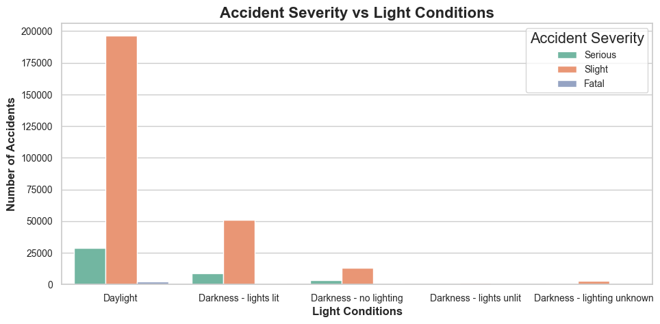

   - Daylight and lit conditions have more total accidents.
   - Darkness and poor lighting conditions correspond to higher severity.

2. **Accident Severity vs Weather Conditions**
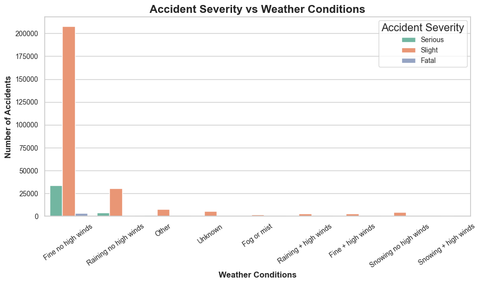
   - Fine weather shows the highest counts.
   - Severe weather (fog, rain, snow) increases fatal and serious accident rates.

3. **Accident Severity vs Road Surface Conditions**
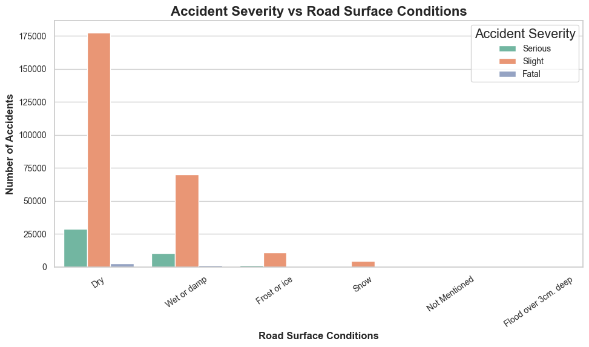
   - Dry roads: higher total counts.
   - Wet/icy roads: higher severity percentage.

4. **Accident Severity vs Speed Limit**
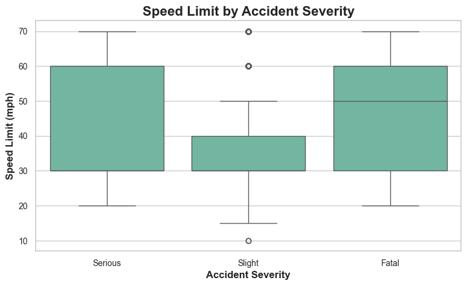
   - Higher speed limits correlate with greater accident severity.

5. **Number of Casualties vs Accident Severity**
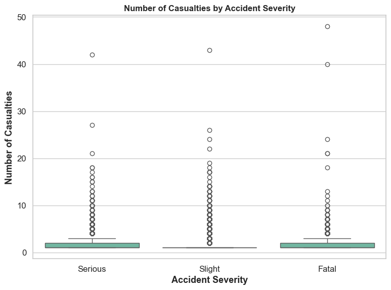
   - Fatal accidents have the highest casualty count per incident.

6. **Accidents by Hour of Day**
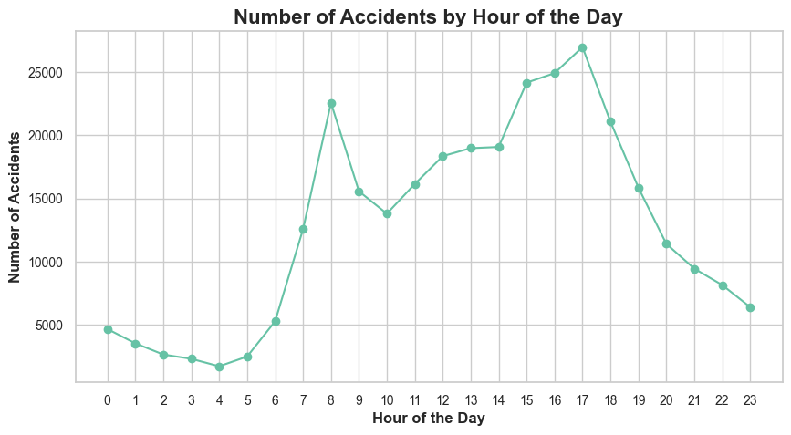
   - Peak hours: 8 AM and 5 PM.
   - Nighttime accidents are fewer but more severe.

7. **Accident Severity by Day of Week**
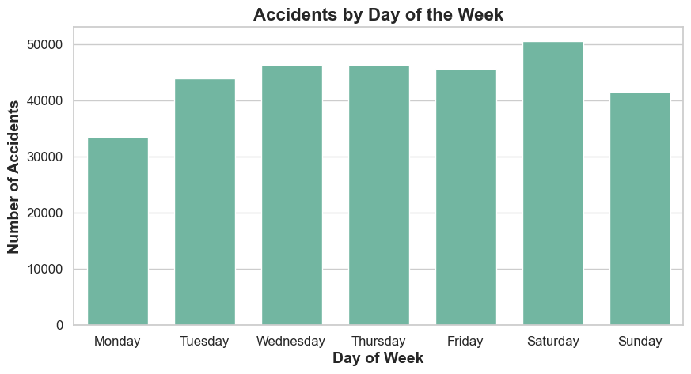
   - Saturdays, Wednesdays, Thursdays and Fridays have the most accidents.

---

## 🔀 Multivariate Analysis

Multivariate analysis examines how multiple factors interact simultaneously to influence accident outcomes.

### Key Findings

1. **Light & Weather Interaction**
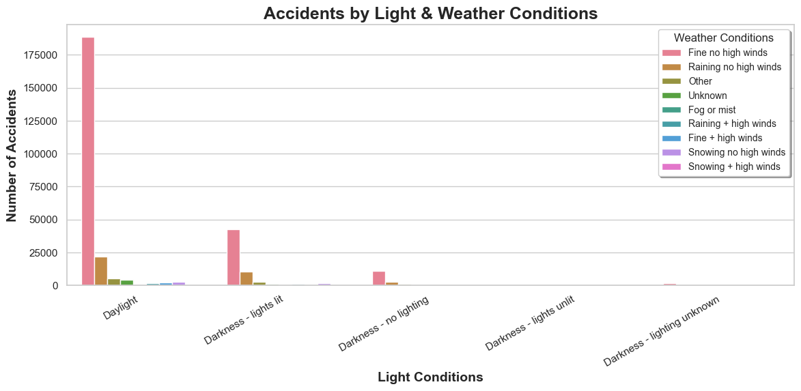
   - Most accidents occur in daylight and fine weather.
   - Fatalities are more likely under **poor visibility** (darkness + fog).

2. **Speed Limit & Road Surface Interaction**
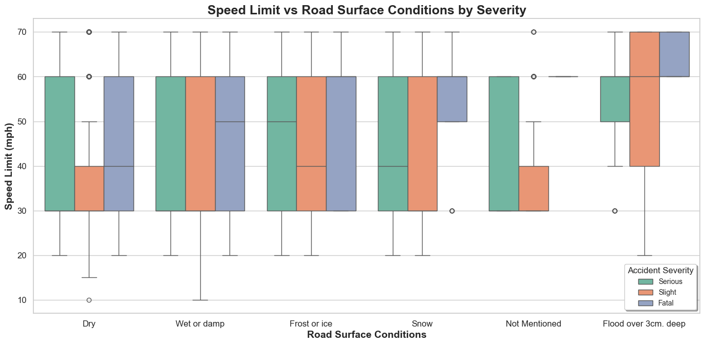
   - **High-speed + wet/icy surfaces** → significantly higher severity risk.
   - Dry roads dominate counts but not fatality proportions.

3. **Day of Week vs Hour of Day**
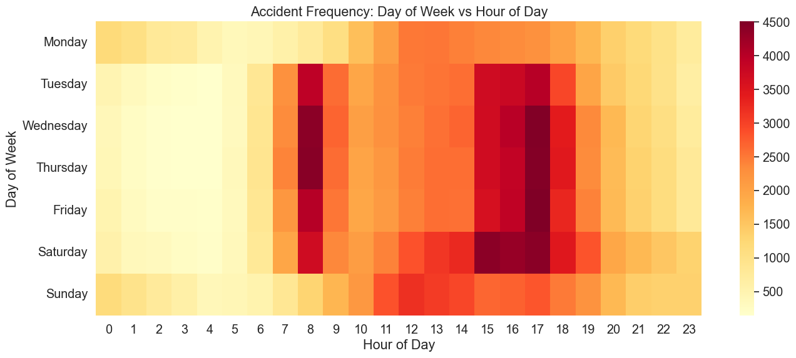
   - **Heatmap** shows rush-hour peaks (7–9 AM, 4–7 PM).
   - **Saturdays, Wednesdays, Thursdays and Fridays** have the most accidents.
   - Late-night accidents are fewer but more likely severe.

4. **Grouped Summary**

   - Average casualties highest during **weekends with adverse weather**.
   - Confirms human behavior (weekend travel) and environmental impact as joint factors.
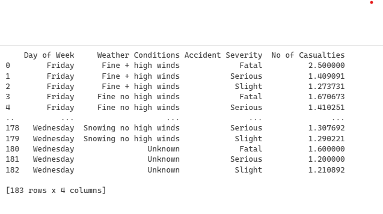

---

## 📊 Statistical Summary

| Variable | Type | Key Insight |
|-----------|------|-------------|
| Accident Severity | Categorical | Majority slight, minority serious/fatal |
| Day of Week | Categorical | Peaks on Friday/Saturday |
| Hour | Numeric | Peaks during rush hours |
| Speed Limit | Numeric | High speed linked to higher severity |
| Number of Casualties | Numeric | Mostly 1–2, increases with severity |
| Weather Conditions | Categorical | Fine weather dominates; rain increases risk |
| Road Surface | Categorical | Dry surfaces frequent; wet/icy surfaces severe |
| Light Conditions | Categorical | Poor lighting increases severity |

---

## 💡 Key Insights

- **Visibility and Lighting**: Darkness and poor visibility are strongly linked to accident severity.
- **Speed and Surface**: High-speed roads with poor surface conditions significantly increase fatal accidents.
- **Time Patterns**: Rush hours have high frequency; nighttime accidents have higher severity.
- **Environmental Effects**: Adverse weather amplifies the impact of other risk factors.
- **Human Behavior**: Weekend and late-night driving patterns correlate with higher accident severity.

---

## 🧠 Conclusions

- The **majority of accidents occur in normal daylight and good weather**, showing that frequency correlates more with exposure than with adverse conditions.
- However, **severe accidents are concentrated** in conditions with **low visibility, high speed limits, and poor road surfaces**.
- **Preventive measures** should focus on:
  - Improving road lighting and reflective signage.
  - Enforcing stricter speed limits under poor weather.
  - Increasing awareness campaigns during weekends and peak hours.
- Insights from this analysis can help policymakers and transport authorities **design safer traffic systems**, **target high-risk conditions**, and **reduce accident severity** through data-driven interventions.

---

## 🛠️ Tools & Libraries Used

- **Python**  
- **Pandas** – Data manipulation and cleaning  
- **NumPy** – Numerical analysis  
- **Matplotlib / Seaborn** – Visualization and plotting  
- **Jupyter Notebook / VSCode** – Development environment  

---

## 📚 Summary

This project demonstrates how Python-based data analytics can be leveraged to derive actionable insights from road safety data. Through systematic univariate, bivariate, and multivariate analyses, I identified **key contributing factors to accident frequency and severity**, enabling data-informed recommendations for **safer road networks and targeted policy interventions**.

---

**Author:** *Maria Egbuna*  
**Project:** *Road Accidents Data Analysis with Python*  
**License:** *MIT License*  
