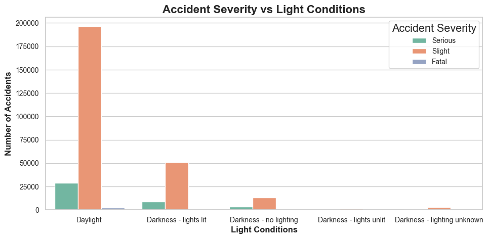
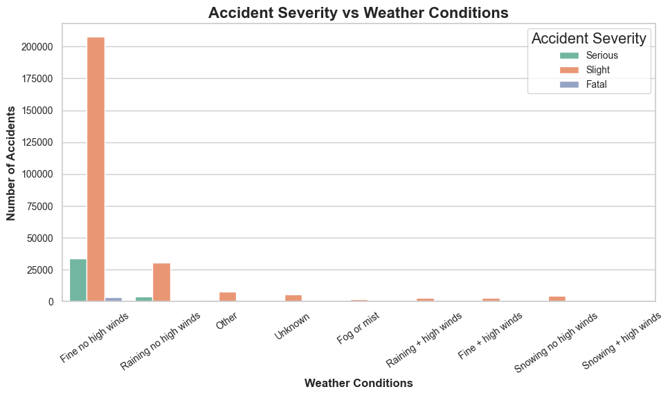
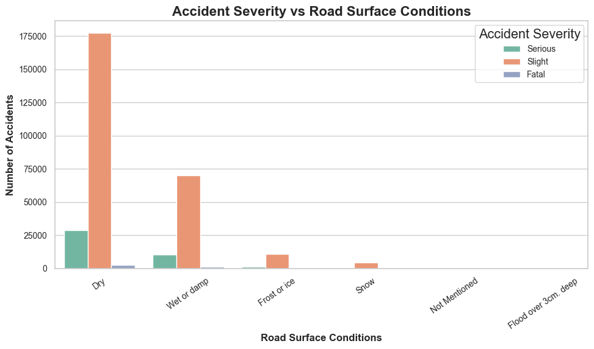
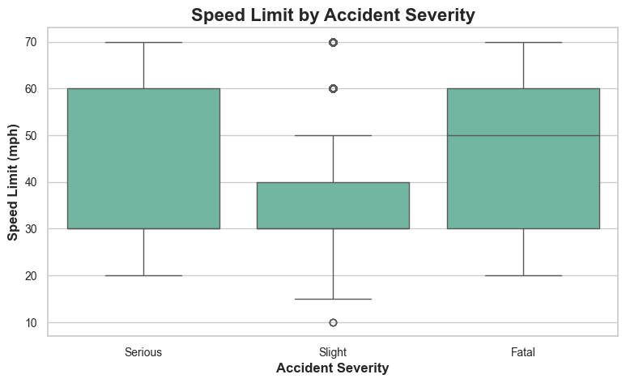
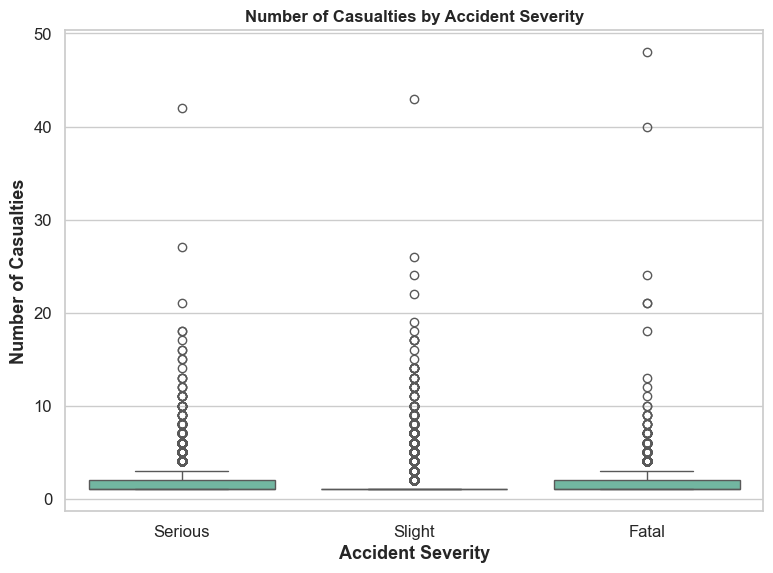
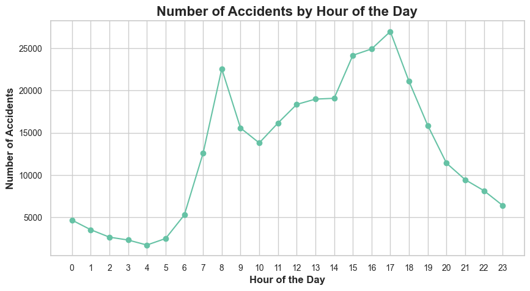
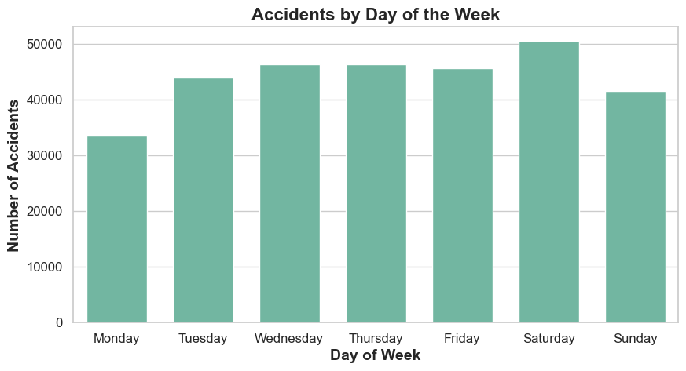
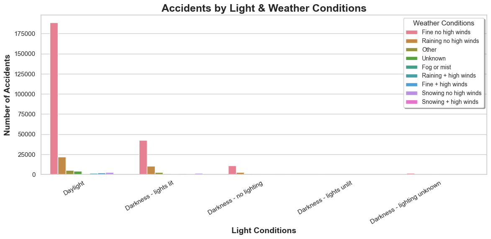
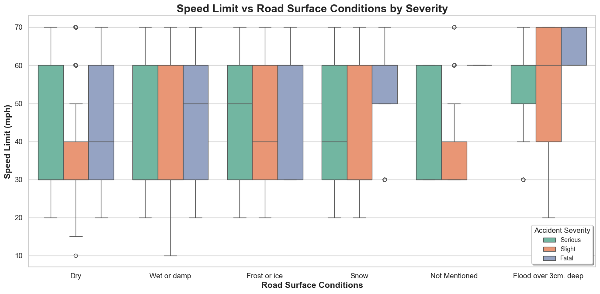
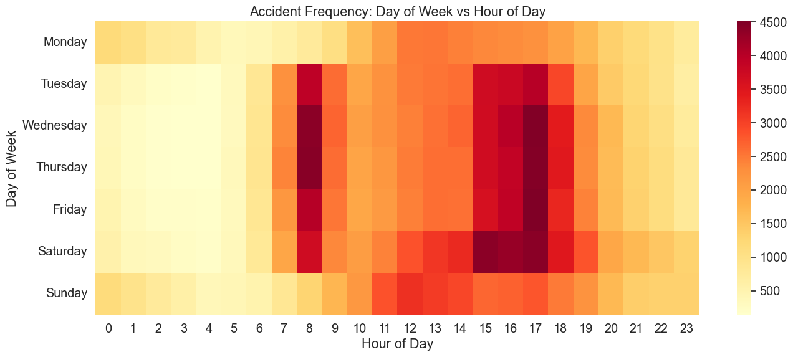

# Understanding Road Accidents in the UK 

## General Overview

### Key Findings

- **Accident Severity**: Majority of accidents were classified as *Slight*, with *Serious* and *Fatal* being less frequent.
- **Day of the Week**: Highest accident counts on **Friday and Saturday**, lowest on **Sunday**.
- **Hour of the Day**: Two major peaks observed — **morning (7–9 AM)** and **evening (4–7 PM)** rush hours.
- **Number of Casualties**: Most accidents involved 1–2 casualties; few had more than 3.
- **Speed Limit**: Accidents most frequent on roads with **30–40 mph** limits.
- **Weather Conditions**: Most accidents occurred in **fine weather**, reflecting higher traffic volume, but **rain** and **fog** increased accident severity.
- **Road Surface Conditions**: **Dry** surfaces had the most accidents; **wet or icy** surfaces showed higher severity rates.
- **Light Conditions**: Majority occurred in **daylight**, but **darkness with lights unlit** showed higher fatal accident ratios.

---

### Visualizations and Insights

1. **Accident Severity vs Light Conditions**

   - Daylight and lit conditions have more total accidents.
   - Darkness and poor lighting conditions correspond to higher severity.

2. **Accident Severity vs Weather Conditions**

   - Fine weather shows the highest counts.
   - Severe weather (fog, rain, snow) increases fatal and serious accident rates.

3. **Accident Severity vs Road Surface Conditions**

   - Dry roads: higher total counts.
   - Wet/icy roads: higher severity percentage.

4. **Accident Severity vs Speed Limit**

   - Higher speed limits correlate with greater accident severity.

5. **Number of Casualties vs Accident Severity**

   - Fatal accidents have the highest casualty count per incident.

6. **Accidents by Hour of Day**

   - Peak hours: 8 AM and 5 PM.
   - Nighttime accidents are fewer but more severe.

7. **Accident Severity by Day of Week**

   - Saturdays, Wednesdays, Thursdays and Fridays have the most accidents.

---

## How do multiple factors interact simultaneously to influence accident outcomes.

### Key Findings

1. **Light & Weather Interaction**
   

   - Most accidents occur in daylight and fine weather.
   - Fatalities are more likely under **poor visibility** (darkness + fog).

3. **Speed Limit & Road Surface Interaction**
   

   - **High-speed + wet/icy surfaces** → significantly higher severity risk.
   - Dry roads dominate counts but not fatality proportions.

4. **Day of Week vs Hour of Day**
   

   - **Heatmap** shows rush-hour peaks (7–9 AM, 4–7 PM).
   - **Saturdays, Wednesdays, Thursdays and Fridays** have the most accidents.
   - Late-night accidents are fewer but more likely severe.

---

## Key Insights

- **Visibility and Lighting**: Darkness and poor visibility are strongly linked to accident severity.
- **Speed and Surface**: High-speed roads with poor surface conditions significantly increase fatal accidents.
- **Time Patterns**: Rush hours have high frequency; nighttime accidents have higher severity.
- **Environmental Effects**: Adverse weather amplifies the impact of other risk factors.
- **Human Behavior**: Weekend and late-night driving patterns correlate with higher accident severity.

---

## Conclusions

- The **majority of accidents occur in normal daylight and good weather**, showing that frequency correlates more with exposure than with adverse conditions.
- However, **severe accidents are concentrated** in conditions with **low visibility, high speed limits, and poor road surfaces**.
- **Preventive measures** should focus on:
  - Improving road lighting and reflective signage.
  - Enforcing stricter speed limits under poor weather.
  - Increasing awareness campaigns during weekends and peak hours.
- Insights from this analysis can help policymakers and transport authorities **design safer traffic systems**, **target high-risk conditions**, and **reduce accident severity** through data-driven interventions.

---

**Analyst:** Maria Egbuna  
**Tools Used:** Python  
**Date:** October 4, 2025  
